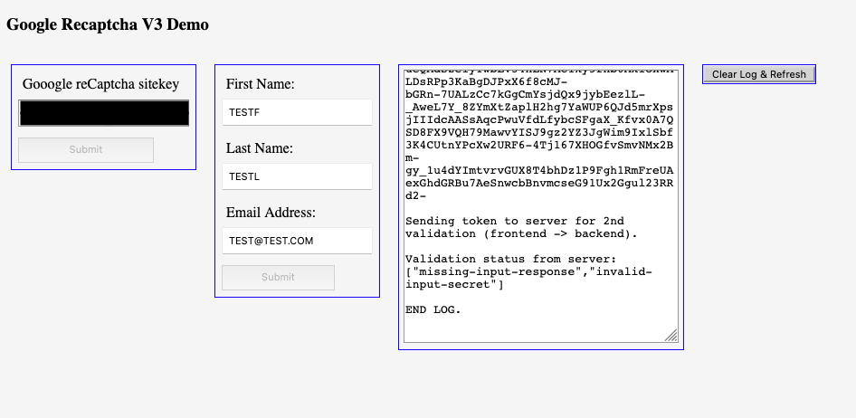

# GoogleRecaptchaV3Service
Google reCaptcha v3 server-side validation using ASP.NET Core 5.0

Example demo for my [dev.to article](https://dev.to/spencer741/google-recaptcha-v3-server-side-validation-using-asp-net-core-5-0-3hfb). All the details there.

### pre-reqs:
[.NET SDK](https://docs.microsoft.com/en-us/dotnet/core/sdk) targeting .NET 5.

### To run:
> dotnet run

### Visual demo
After running, https://localhost:5001/ takes you to the home page.

### Issues
* If there are any issues, open an issue.
* If you would like to make a contribution, open an issue before you PR.

